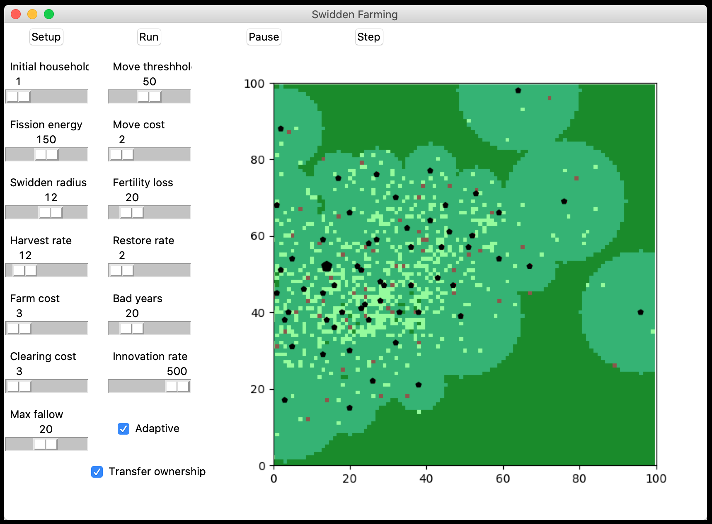

# Swidden Farming Agent-Based Model

A simple Python version of the model developed by Michael Barton (<a href="https://doi.org/10.1007/s10816-013-9187-2">2013</a>) for NetLogo.

<h3>References</h3>

Barton, C. M. (2013). <a href="https://doi.org/10.1007/s10816-013-9187-2">Complexity, Social Complexity, and Modeling</a>. Journal of Archaeological Method and Theory, 1–19.

Barton, C Michael (2013, June 12). “Swidden Farming Version 2.0” (Version 1.0.0). CoMSES Computational Model Library. Retrieved from: https://www.comses.net/codebases/3826/releases/1.0.0/

